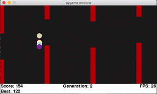
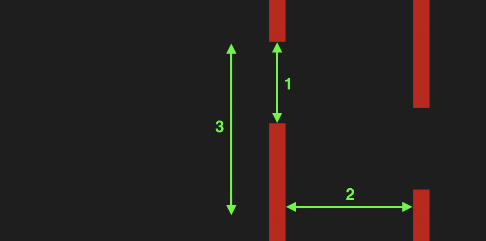
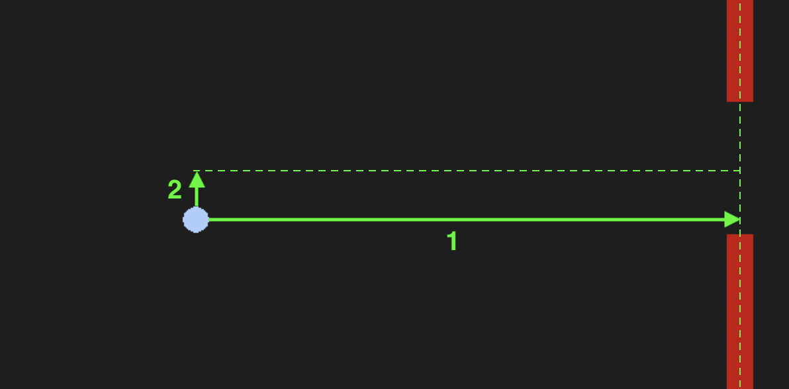
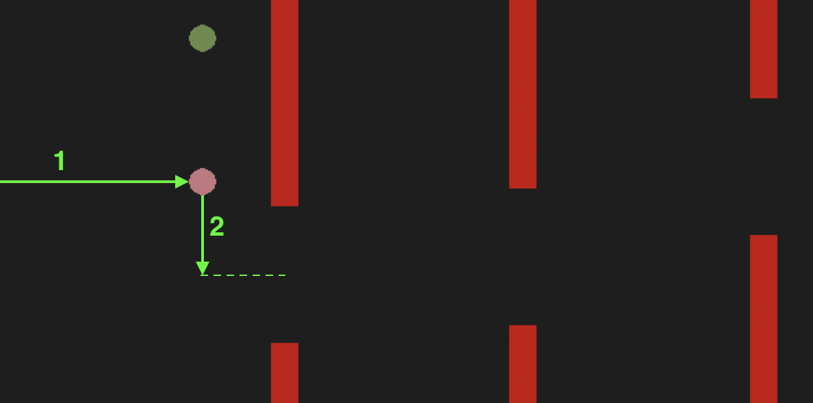
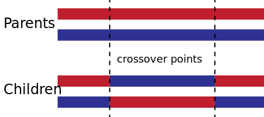

# Flappy Ai: A genetic algorithm approach

Github Pages: https://puechtom.github.io/PCBS-flappyai/

The goal of this project was to try out neural networks with genetic algorithms. In order to do this, I choosed a flappy bird like game due to its simplicity of development. The aim is to create little birds with really simple "brains" and let them try to go as far as possible in the virtual world. When all the birds are dead, we select the best ones, make them reproduce to create a new generation of birds and we start the process over again. After a few generation, thanks to natural selection principle, we should see some interesting behaviours appearing in the population and at each new generation, the birds should perform better.

## 1. Virtual world
The virtual world is composed of obstacles and the birds have to avoid them in order to progress in the virtual world.

Obstacles are composed of two parts, the top one and the bottom one. We can adjust the difficulty of the level by changing three parameters:
1. the distance between the top and bottom parts
2. the distance between two obstacles
3. the range in which the hole in the obstacle can be placed
<figure>
    
</figure>

## 2. Birds
Here, birds are represented by circles (imagination is required) and each bird has a small neural network which can be very roughly assimilated to their "brain". This neural network is composed of 3 layers of neurons. The first layer is the input layer, the second layer is called the hidden layer and the third one is the output of the network.
<figure>
    
    <figcaption>© Wikipedia</figcaption>
</figure>

For our network, we have only 2 input neurons, 6 neurons for the hidden layer and 1 output neuron.
### 2.1 Input layer
The input layer is composed of only 2 neurons. It means that each bird have only access to 2 inputs (aka features) and have to make decision based only on this 2 features. The first feature represents the distance between the bird and the next obstacle. The second is the difference of height between the bird and the center of the hole of the next obstacle.

<figure>
    
</figure>

### 2.2 Hidden layer
The number of hidden layers and neurons per layer is variable. It depends on the complexity of the problem to solve, however the more layer and neurons, the more time to converge will be necessary. Thus, for this example we choose to use only 1 layer with 6 neurons and fully connected

### 2.3 Output layer
The output layer represents the answer of the network to a given input. In our case, the output can be reduced to a single neuron. If the value of this output neuron is >0.5, the bird "jumps", otherwise the bird does nothing.

### 2.4 Weights
In a neural network, each neuron has a weight. If we want a specific output for a given input, the weights of the network must be tuned. For example, in our case, weights must be tuned in order to make the bird "jumps" (output >0.5) when the distance between the bird and the next obstacle is low and when the bird is a bit lower than the hole in the obstacle.

## 3. Genetic algorithm
Genetic algorithm will be the method used to find the correct weights of the neural network. Initially, weights are generated by a random process. Genetic algorithm will used natural selection in order to select the individuals who perform the best and make them reproduce in order to create a new generation. Thus, this new generation will perform better than the previous one  since it has been created by the best indivuals of the previous generation. If we let this process creating tons of generations, we should get a bird we "learn" by itself how to perform well in this virtual world.

### 3.1 Fitness
As said earlier, we need to select the best birds of a given generation. In other words, we need to find a way to evaluate the performance of each bird at a given generation. To do so, we use a fitness score. The fitness score is computed for each bird and it is based on 2 metrics:
1. the total distance traveled by the bird
2. the height difference between the bird and the center of the obstacle
<figure>
    
</figure>

For example, here, the pink bird will have a higher fitness score than the green one because they have the same value for the 1st feature but for the 2nd feature which is counted as negative, the green bird have a higher value.

### 3.2 Crossover
The crossover is the process used to create new birds from the best ones of the previous generation. A bird is only characterized by their weights, therefore in order to create a bird (children) from two other birds (parents), we need to find a way to mixup the weights of the parents. In this example, we used a k-points crossover process:
<figure>
    
    <figcaption>© Wikipedia</figcaption>
</figure>

Thus, the new bird (children) has weights corresponding of parts from his father and parts from his mother. Parents are selected randomly from the best birds of the previous generation.

    def crossover(bird1, bird2, k=1):
        b1_layers = bird1.get_layers()
        b2_layers = bird2.get_layers()

        b_layers = []
        for layers in zip(b1_layers, b2_layers):
            flatten_layer1 = layers[0].flatten()
            flatten_layer2 = layers[1].flatten()
            flatten_layers = [flatten_layer1, flatten_layer2]
            length = len(flatten_layer1)
            k_points = [0]
            k_points += sorted(np.random.choice(range(0, length), k))
            k_points.append(length)
            choices = []
            for i, (k1, k2) in enumerate(zip(k_points, k_points[1:])):
                for n in range(k2-k1):
                    choices.append(i%2)
            b_layer = []
            for i, c in enumerate(choices):
                b_layer.append(flatten_layers[c][i])
            b_layer = np.array(b_layer).reshape(layers[0].shape)
            b_layers.append(b_layer)

        bird = Bird()
        bird.set_layers(b_layers)
        return bird

### 3.3 Mutation
In order to avoid being stuck in a sub optimal behaviour, we added mutation. Mutation is a process which randomly changes a weight of a new bird with a low probability. This random change may induce a completly new behavior which can be benefic. If it is, the mutated bird will be selected for the new generation and thus the mutation will spread through childrens.

    def mutate(bird, k=1):
        layers = bird.get_layers()
        lengths = []
        for layer in layers:
            lengths.append(layer.shape[0]*layer.shape[1])
        choice = np.random.randint(0, len(layers))
        layer = layers[choice]
        x = np.random.randint(0, layer.shape[0])
        y = np.random.randint(0, layer.shape[1])
        value = np.random.randn()
        layers[choice][x][y] = value
        bird.set_layers(layers)

